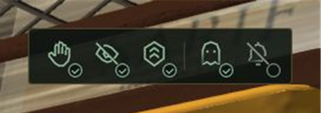
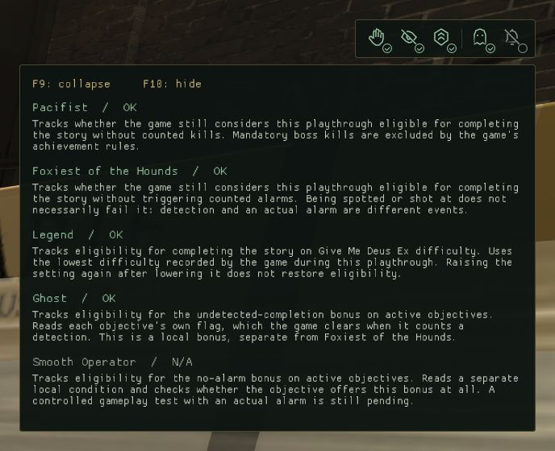

# Stealth HUD for Deus Ex: Human Revolution - Director's Cut

A minimal in-game HUD that helps you follow achievement and stealth conditions as you play: **Pacifist, Foxiest of the Hounds, Legend, Ghost and Smooth Operator**, plus **Factory Zero** during The Missing Link.

[Download the installer](https://github.com/radixun/dxhr-stealth-hud/releases/latest)

## Preview

**Compact - eligible conditions** (Smooth Operator is not applicable in this scene):

**Compact - failed Legend condition:**

**Expanded descriptions:**

These are cropped in-game screenshots. The compact crops are enlarged 2x for readability.

## Install

1. Close the game and run `StealthHUD-Setup-0.3.1.exe` from Releases.
2. Select the folder containing `DXHRDC.exe` (Steam libraries are detected automatically).
3. Choose **Install**, enable **DirectX 11** in the game and launch through Steam.

The installer includes the modified DXHRDC-GFX plugin and ASI Loader. It preserves existing INI settings, checks the executable, and backs up the previous graphics plugin before replacing it. A different existing `winmm.dll` blocks automatic installation instead of being overwritten. Fresh installs retain the Director's Cut graphics style.

**F9** expands/collapses descriptions. **F10** hides/shows the HUD. **F11** opens the inherited graphics controls.

## What it tracks

| Indicator | Condition |
| --- | --- |
| Pacifist | The game's run-wide no-counted-kills eligibility flag. |
| Foxiest of the Hounds | The game's run-wide no-counted-alarms eligibility flag. Being spotted is not automatically an alarm. |
| Legend | The lowest difficulty recorded for the playthrough; requires Give Me Deus Ex. |
| Ghost | Undetected-completion eligibility on applicable active objectives. |
| Smooth Operator | No-alarm bonus eligibility on applicable active objectives. |
| Factory Zero | The Missing Link eligibility flag; shown during DLC scenes. |

Green means eligible, red means failed, amber means active objectives disagree, a grey dash means not applicable, and a question mark means unknown/loading. Local bonuses summarize **all applicable active objectives**, not just the selected quest.

## Compatibility and limitations

Windows 10 or later, Steam Director's Cut, DirectX 11. The original Human Revolution and other executable builds are unsupported. Supported EXE SHA-256: `8266b6b4a5bf25f2f4e8de068aa3720f6289c962bb1c2bb70a7b1c111ba510a1`.

This is a modified **DXHRDC-GFX**, not a second plugin to load alongside it. Existing graphics settings are preserved. No game EXE or saves are patched. The tracker reads condition flags and does not unlock achievements.

Early public release: kill and difficulty detection were gameplay-tested; Ghost flags and bonus availability were observed in a live game. Full controlled alarm/reload tests and Factory Zero validation remain incomplete. Eligibility is not a guarantee of the final achievement award.

## Restore

Run the installer again and choose **Restore previous**. It restores the prior graphics plugin, or removes the HUD plugin if there was no prior one. Changed plugin files are protected from automatic overwrite. INI files and the shared ASI Loader are retained to avoid disrupting other mods. Original backups remain archived beside the game.

## Build

- Native plugin: run `native/build_hud.cmd` with Visual Studio 2022 C++ Build Tools installed. Run `native/test_hud.cmd` for the draw and condition-reader checks.
- Installer: run `installer/build.ps1` with Windows .NET Framework 4.x. The embedded payload is in `installer/payload`. To package a rebuilt plugin, replace its `DXHRDC-GFX.asi` first.
- Installer transaction tests are in `installer/SetupTests.cs` (compile with `Setup.cs`, the same embedded resources, and `/main:SetupTests`). They take an isolated output folder and a supported game EXE path; they never launch or modify the original game.

## Credits

Based on [DXHRDC-GFX](https://github.com/CookiePLMonster/DXHRDC-GFX) by Adrian Zdanowicz (Silent), using ModUtils and Dear ImGui. Includes [Ultimate ASI Loader](https://github.com/ThirteenAG/Ultimate-ASI-Loader) by ThirteenAG and contributors. License notices are included. This is an unofficial community modification, not an official release by those authors.
